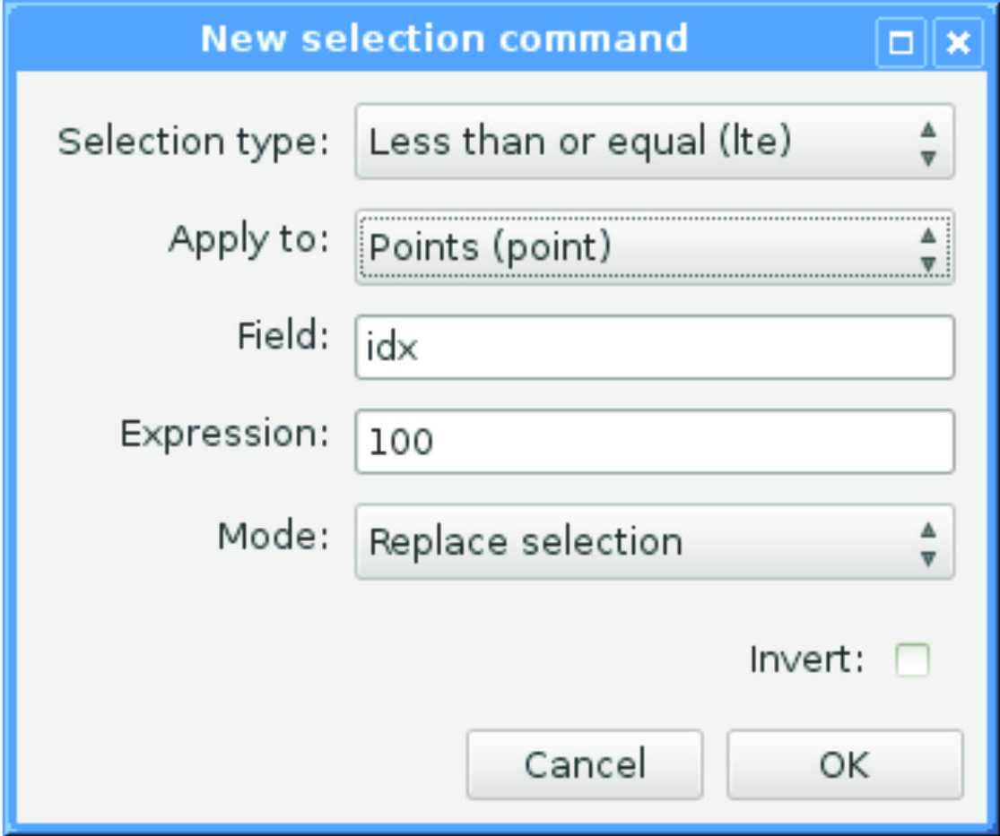

# 6. Data Selections

Sometimes it may be desirable to reduce the data to a _selected subset_ of records, e. g. for separate processing and export of smaller areas within a larger survey region. For this purpose, it is possible to specify one or more selection commands on the command line using the "-S" option (see 6.1 for details):

```
-S seltype:geomtype:field:expression -S seltype:geomtype:field:expression [-S ...]
```

The effect of this is that only those records, whose attribute table contents and geometry types pass one or more selection criteria (expressions), will be retained in the output. The selection will take place immediately after all geometries have been assembled and before any further processing, such as topological cleaning (see 9). Selection commands can be applied to some or all geometry types (points, lines, polygons).

> Complex geometries (lines and polygons) can consist of many original point records (vertices), but only one attribute table record, once assembled. Selections on the attributes of assembled geometries cannot be guaranteed to match original vertex values. E. g. the coordinate values of the individual vertices are not preserved (except for the first one's) in the attribute record of a polygon or line, so selecting a singular value of the "Z" coordinate may fail to produce the intended matches. In such cases, selecting a range of values or using a regular expression (see 6.2 for details on both) will often give better results.

## 6.1 Selection Command Syntax

Each selection command has a fixed syntax that consists of up to four tokens, named "seltype", "geomtype", "field" and "expression", separated by a ":" (colon), plus one or two optional modifiers ("*" and/or "+" or "-"; items in square brackets are not required in all cases):

```
[*]seltype[+|-]:geomtype[:field:expression]
```

1. The first token defines the type of selection (see 6.2) to apply, optionally including modifiers to invert ("*"), add to ("+") or subtract from ("-") an existing selection (see 6.3 for details).
2. The second token stands for the geometry type to include in the selection. This can be "point", "raw", "line", "poly" or "all".
3. The third token is the name of the field (see 4.3) to which the expression (see below) applies. Note that field names are treated as case-insensitive, meaning that e. g. "feature" and "FEATURE" both refer to one and the same field (see item "name" under 4.3).
4. The fourth token is the selection expression. In the most simple case, this expression is the text to which the field's contents should be compared. More complex expressions arise in the case of regular expression type selections (see 6.2).

The third and fourth tokens must not be specified if the selection type is set to "all" (i. e. select all records regardless of attribute field content).

When using text expansion/replacement on a field's content (see explanation of the "@" operator in 4.3), the selection expression will be applied to the expanded/replaced content, not the original data.

In order to avoid problems on the command line with expressions that contain spaces, the entire filter argument should be surrounded with quotation marks (see examples in this section). This is not an issue when using the graphical user interface.

## 6.2 Selection Types

The following comparative selection types can be applied to attribute fields of all types (text and numeric). Comparisons are done against the text in the "expression" token:

### eq
The "equal" type (eq) selects only those records whose attribute field contents are equal to the given expression.

### neq
The "not equal" (neq) type selects only those records whose attribute field contents are not equal to the given expression.

### lt
The "less than" (lt) type selects only those records whose field contents are "less than" the given expression. In the case of numeric fields, the meaning of this is intuitive. In the case of text fields, the comparison is done lexicographically, i. e. both field contents are sorted as in a dictionary, and the one that comes first in the sorted order is "less than" the other.

### gt
The "greater than" (gt) type selects only those records whose field contents are "greater than" the given expression. In the case of numeric fields, the meaning of this is intuitive. In the case of text fields, the comparison is done lexicographically, i. e. both field contents are sorted as in a dictionary, and the one that comes second in the sorted order is "greater than" the other.

### lte
The "less than or equal" (lte) type works in the same way as the "less than" type (see above), but it also selects those records whose field contents are "equal" to the given expression.

### gte
The "greater than or equal" (gte) type works in the same way as the "greater than" type (see above), but it also selects those records whose field contents are "equal" to the given expression.

**Examples** (note the use of quotation marks on the command line to prevent problems with spaces in the expression token):

```
-S "eq:poly:objname:boundary"
-S "eq:poly:objname:boundary type A"
-S "gte:all:elevation:12.00"
```

There is one selection type that can only be applied to numeric fields:

### range
Selects only those records whose numeric field contents fall within a "minimum to maximum" (inclusive) range specified by the user. When applying a range selection, the "expression" token must be of the format "min;max", e. g.:

```
-S "range:point:elevation:100.0;120.0"
```

There are also some selection types that can only be applied to fields of type text:

### sub
Selects only those records whose field contents contain the expression as a subset. The example below selects "boundary", "Boundary", "boundaries", "closed boundary", etc.:

```
-S "sub:poly:objname:oundar"
```

### regexp
Selects all records that match a regular expression [https://en.wikipedia.org/wiki/Regular_expression](https://en.wikipedia.org/wiki/Regular_expression). The set of supported operators is listed below (See [https://github.com/cesanta/slre](https://github.com/cesanta/slre)):

- `^` Match beginning of field content.
- `$` Match end of field content.
- `()` Grouping and substring capturing
- `\s` Match whitespace.
- `\S` Match non-whitespace.
- `\d` Match decimal digit.
- `\n` Match new line character.
- `\r` Match line feed character.
- `\f` Match form feed character.
- `\v` Match vertical tab character.
- `\t` Match horizontal tab character.
- `\b` Match backspace character.
- `+` Match one or more times (greedy).
- `+?` Match one or more times (non-greedy).
- `*` Match zero or more times (greedy).
- `*?` Match zero or more times (non-greedy).
- `?` Match zero or once (non-greedy).
- `x|y` Match x or y (alternation operator).
- `\meta` Match one of the meta character: `^$().[]*+?|\`.
- `\xHH` Match byte with hex value 0xHH, e.g. \x4a.
- `[...]` Match any character from set. Ranges like [a-z] are supported.
- `[^...]` Match any character but ones from set.

**Example:**
```
-S "regexp:all:objname:type 1|type 2"
```

The above selects all records that have either "type 1" or "type 2" as their "objname".

> Regular expressions in Survey2GIS do not support Unicode characters.

Finally, there is one special selection type:

### all
An "all" type selection matches, as the name implies, all records, regardless of attribute field types and contents. Its purpose is to allow selecting geometry types without filtering by attribute values. In this case, neither the "field" nor the "expression" token must be specified. E. g. to select all "line" type records:

```
-S "all:line"
```

## 6.3 Selection Modifiers and Chains

It is possible to invert the effect of a selection command (including both geometry and selection type specifications) by prefixing the type token with a "*" (asterisk). E. g. the following selects those records that do not have the content "boundary" in their "objname" field:

```
-S "*eq:all:objname:boundary"
```

Each selection type also has an alternative name, spelled in capital letters:

```
EQ,LT,GT,LTE,GTE,SUB,REGEXP,RANGE,ALL
```

Using these versions on text type fields results in a case insensitive comparison. This has the same effect as converting both the field's content and the expression to all upper case letters before comparing them. E. g.:

```
-S "EQ:poly:objname:Boundary"
-S "EQ:poly:objname:boundary"
-S "EQ:poly:objname:BOUNDARY"
```

...will all match "Boundary", "BoUNDary", etc.

When selecting from numeric type fields, there will be no difference between the results of either version. The same is true for "ALL".

It is possible to create a selection chain by applying several selection commands to one or several fields. This will successively refine the selection result and is achieved using the "+" (add to current selection result) and "-" (subtract from current selection result) modifiers, which have to be suffixed to the selection type token.

In summary, the following rules apply:

1. Initially, all records are part of the selection (this is the equivalent of an "all:all" selection).
2. One or more selection commands can be specified, they will be processed in order of specification.
3. The modifier "+" adds the result of the selection command (matched records) to the current selection.
4. The modifier "-" subtracts the result of the selection command (matched records) from the current selection.
5. If neither modifier is given, then the current selection will be replaced with the result (matched records) of the selection command.
6. After all selection commands have been applied, only those records that are still part of the selection will appear in the output file(s).

The selection commands will be applied and records added or subtracted from the selection, in the same order as they are specified by the user. E. g. the example sequence below (enter all three "-S" options on one command line) will first select all records for which the field "objname" (object name) contains "oundar", such as "Boundary"; the second command will then remove all records from the selection, for which the field "objname" is set to "closed boundary"; the third command will leave only those records in the final selection result, for which the field "objtype" is not set to "breakline" (all expressions are not case sensitive).

```
-S "SUB:poly:objname:oundar"
-S "EQ-:poly:objname:closed boundary"
-S "EQ-:poly:objtype:breakline"
```

> Details about each selection command's effect on the data will be displayed in the form of status messages during processing.

## The GUI's Selection Command Editor

It is also possible to compose selection commands using the graphical user interface (GUI, see 3). To do so, click on the button labeled "Selection:". This will produce a list of currently defined selection commands. Click "Add" to define a new selection command or "Edit" to modify an existing one. In both cases, a form similar to the one pictured below will appear.



Selection commands can be constructed by filling in all required fields of the form. In the case of selection type "all", any input for "Field:" and "Expression" will be ignored and discarded once the form is closed with a click on "OK". Note that pressing "OK" will also trigger a syntax check of the entered selection command. This check only validates the formal correctness of the command. It does neither check whether the command will produce a non-empty selection, nor does it check for valid field names and types. Because the latter are completely data-dependent, they can only be checked once the program is run. Therefore, the status messages of Survey2GIS should be watched carefully to verify selection results.

Selection commands will be processed in the same order (top to bottom) in which they appear in the list of selections.

Saving the current GUI settings into a ".s2g" settings file will also save all currently defined selection commands.

> **Technical note:** The "|" (pipe) character is used to represent the logical "or" operator in regular expressions. At the same time, it is used as a list separator in Survey2GIS settings files (see 3). To avoid conflicts when loading/saving regular expressions from/to settings files and at the same time retain compatibility with older versions of Survey2GIS, the "|" character will be stored as ASCII character #30 (RS, record separator) in settings files. This must be taken into account, should the need arise to edit settings files that contain regular expressions outside of Survey2GIS.